Book Shop

Веб-приложение интернет-магазина книг с реализованной пользовательской и административной частью.
Включает каталог, фильтрацию, работу с заказами и управление данными. Основное внимание уделено архитектуре компонентов, управлению состоянием и удобству пользовательского взаимодействия.

Стек технологий

React
TypeScript
Vite
Tailwind CSS

Функциональность

Пользовательская часть:

просмотр каталога
фильтрация по цене
добавление в избранное
оформление заказа
просмотр личного кабинета

Административная часть:

управление книгами
управление пользователями
просмотр заказов
отчёты

Структура проекта
src/
 ├── components/   // используемые компоненты
 ├── pages/        // страницы приложения
 ├── context/      // глобальное состояние
 
Установка и запуск
npm install
npm run dev
После запуска приложение будет доступно по адресу:
http://localhost:5173

Скриншоты
Главная и каталог
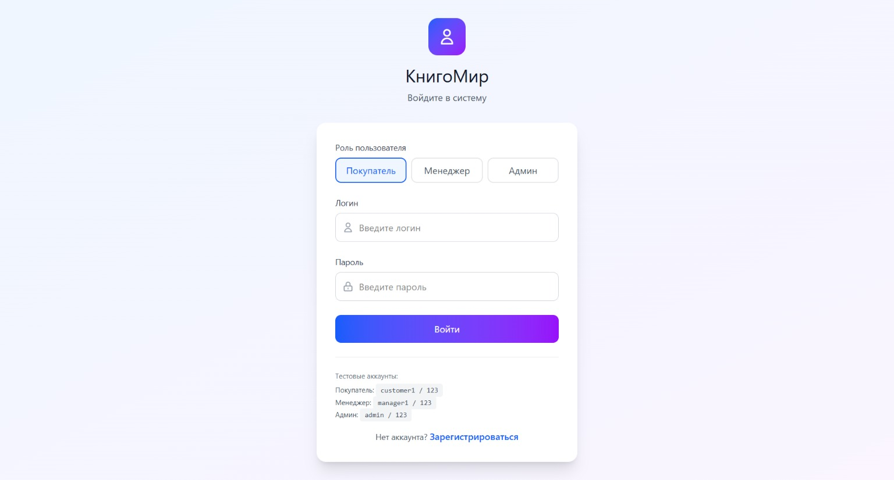
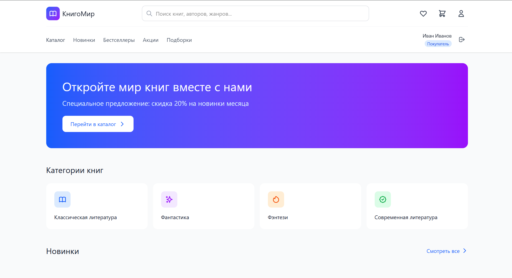
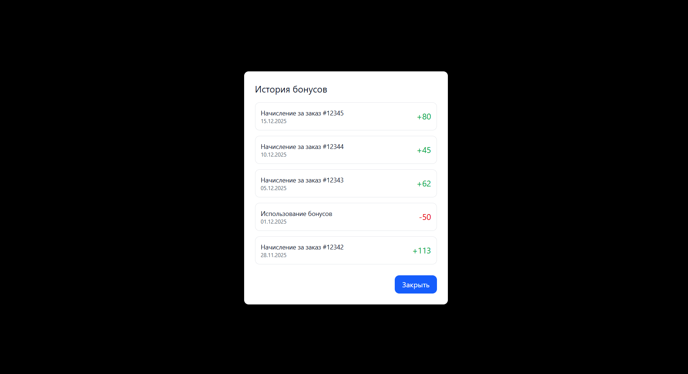
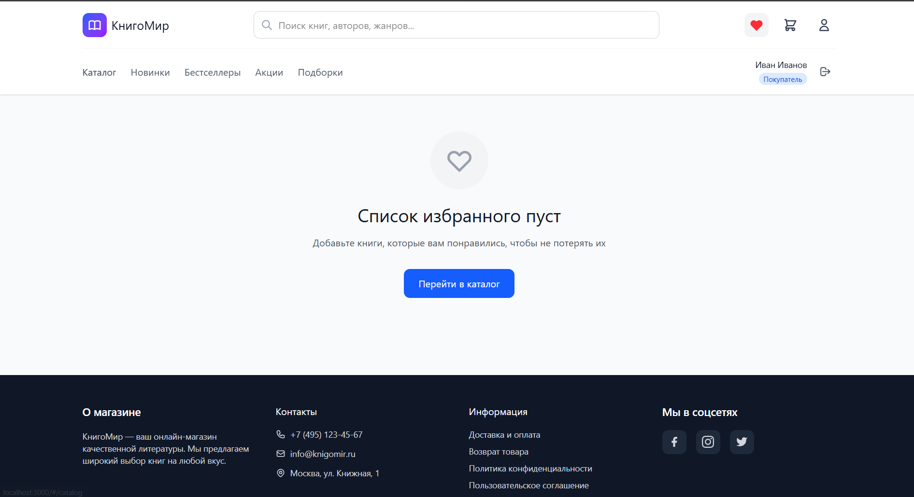

Пользовательский функционал
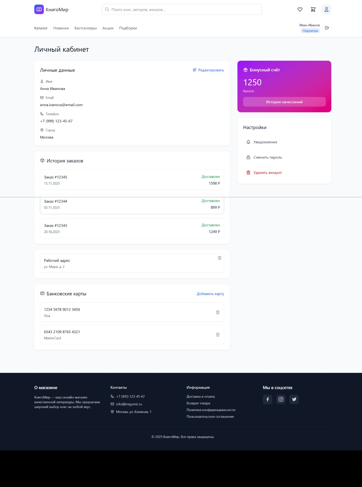

Административная панель
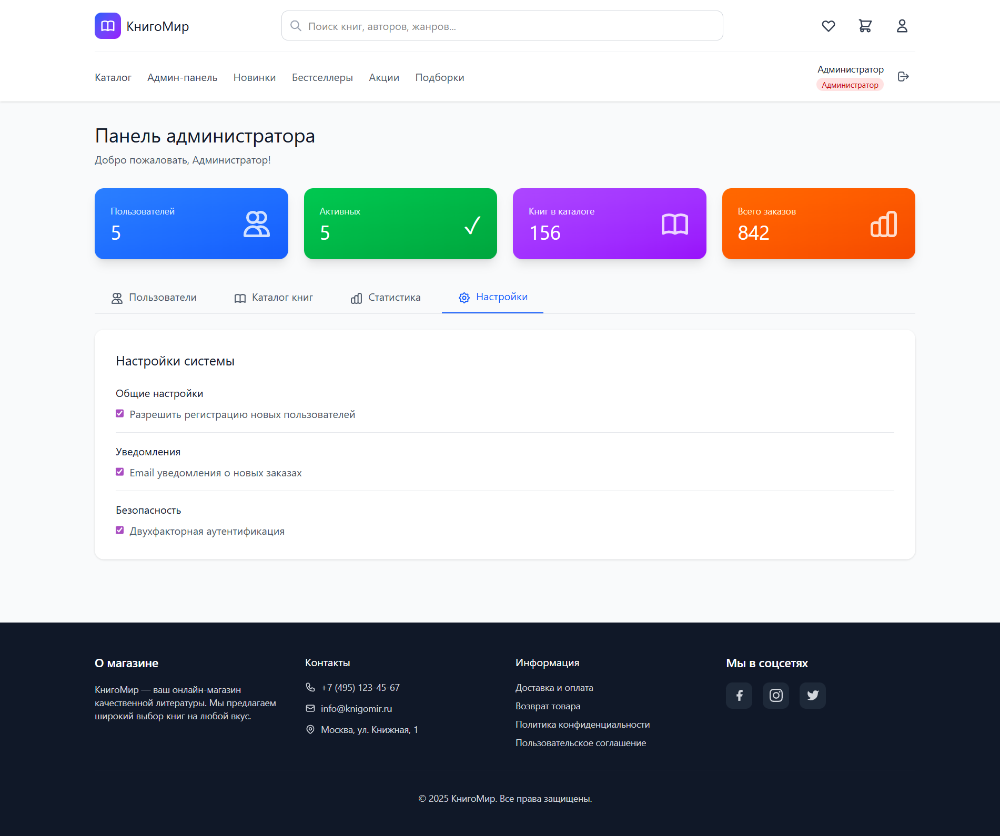
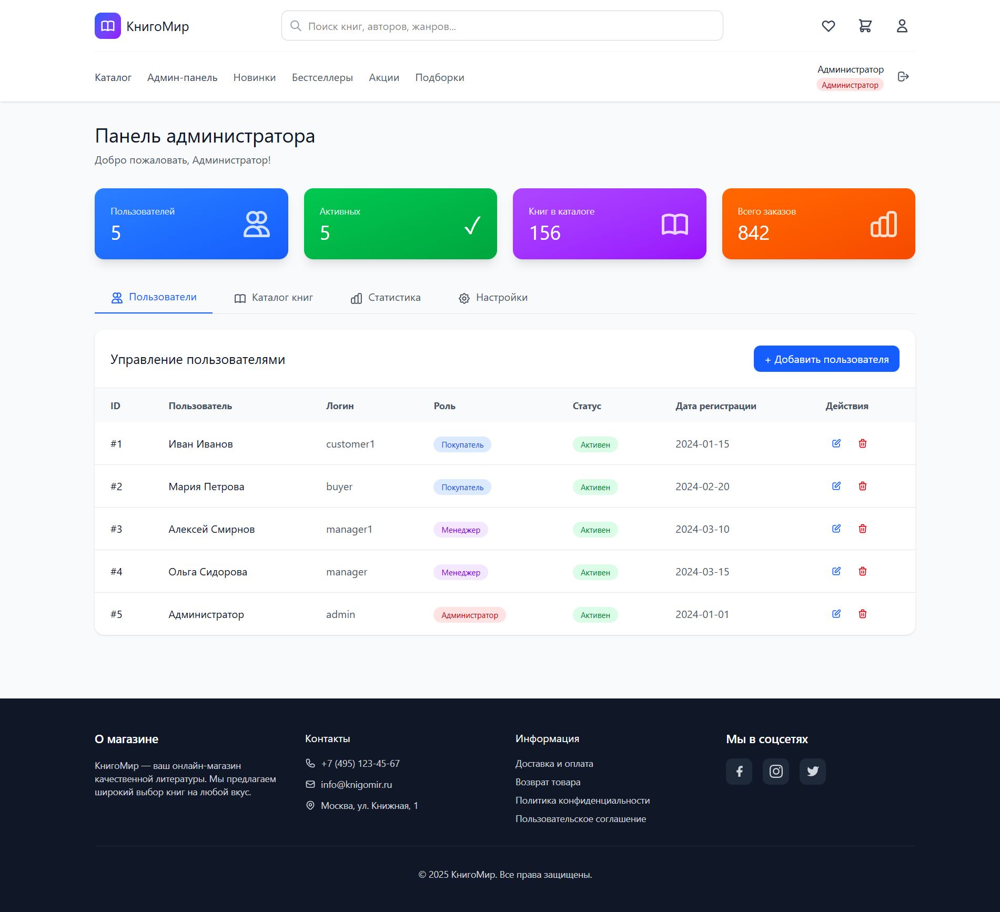

Панель менеджера
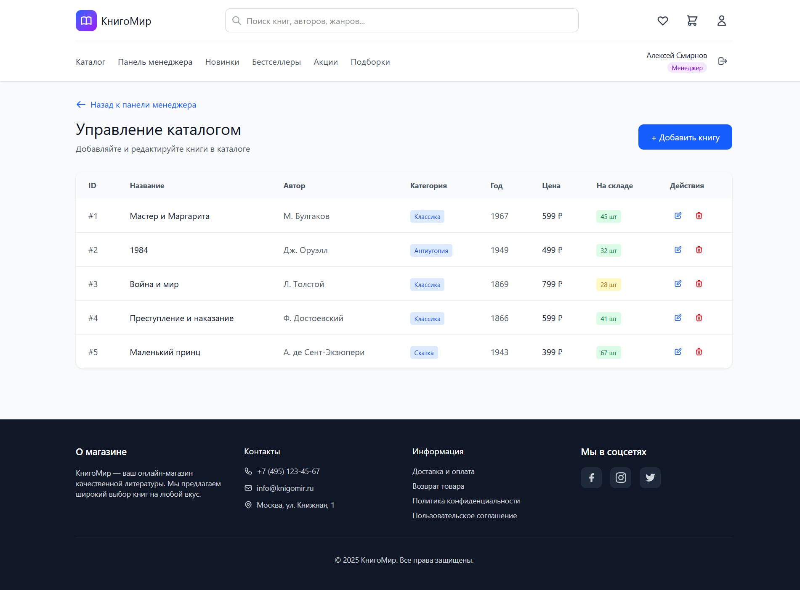
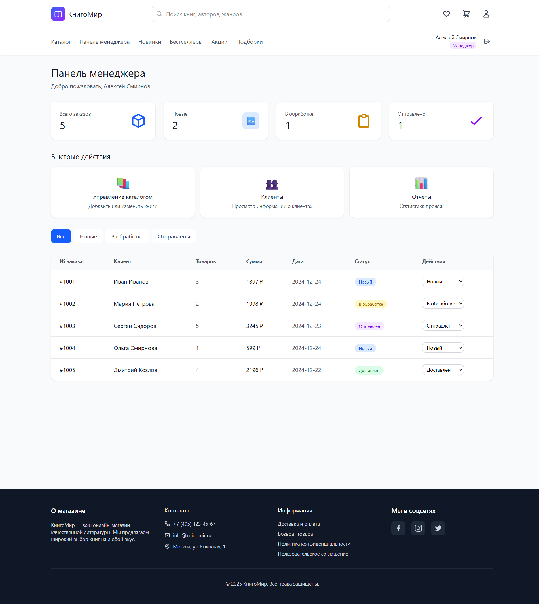
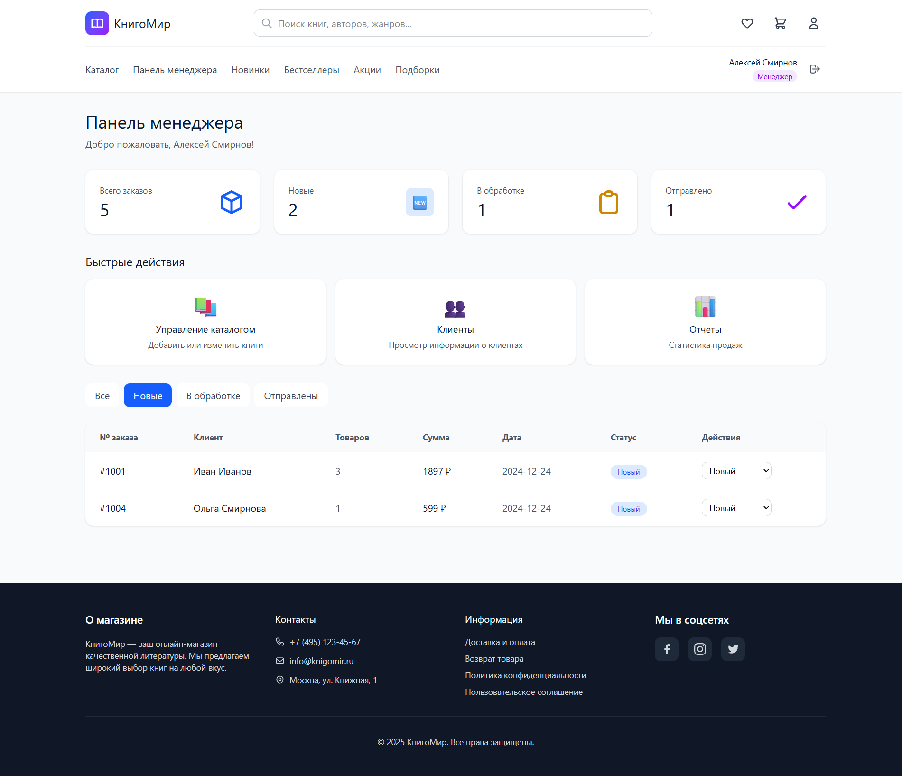
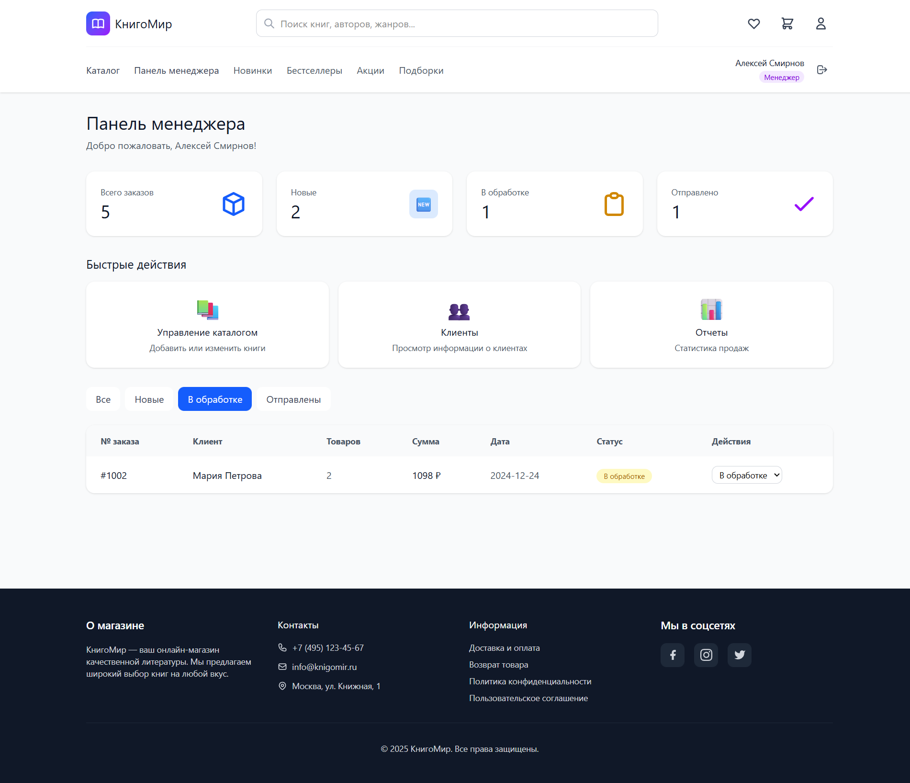
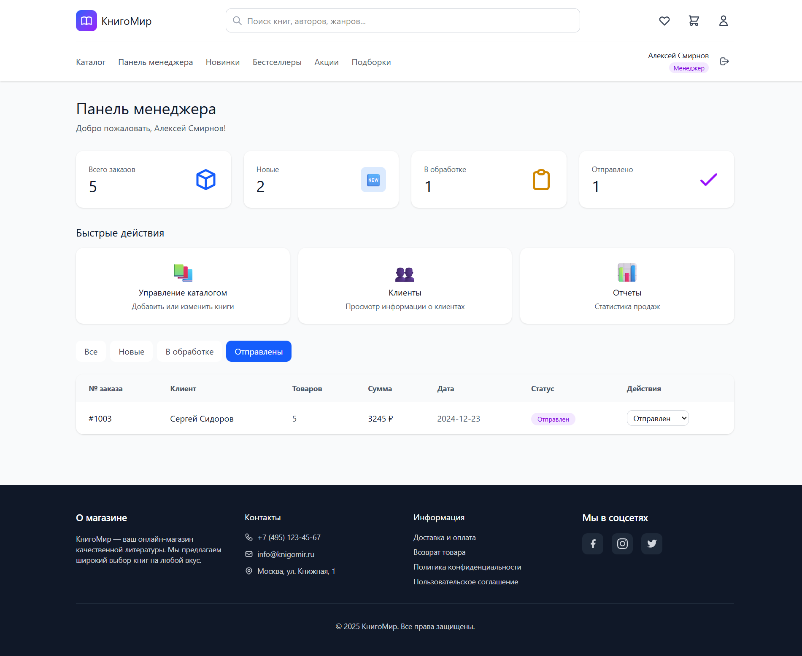
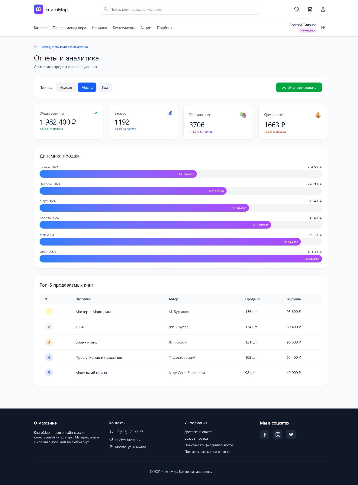

Дополнительно
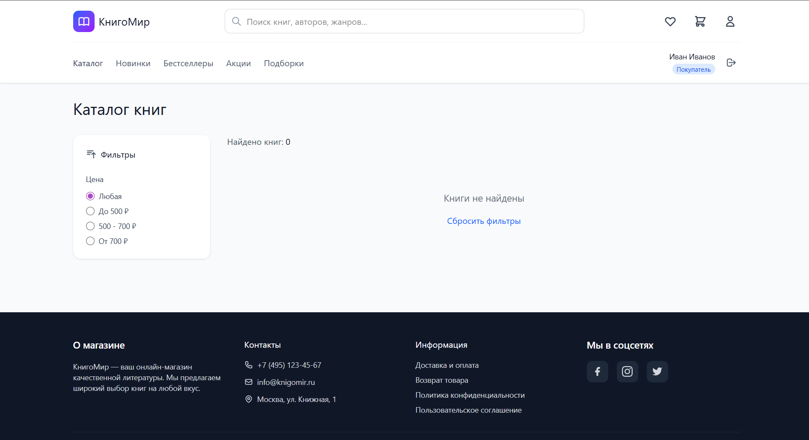

Особенности

В проекте используется Context API для управления данными и useMemo для оптимизации фильтрации.
Структура приложения разбита на отдельные компоненты, что упрощает масштабирование.

Планы по развитию
добавить поиск по названию
реализовать корзину
улучшить адаптивность
выложить проект в продакшен

Автор
Анна Кондратьева

Демо
https://book-shop-pink-seven.vercel.app/

Источник дизайна
https://www.figma.com/design/F6asBFYdiQnJTeXWe8mAfi/User-Interface-Design-Project
